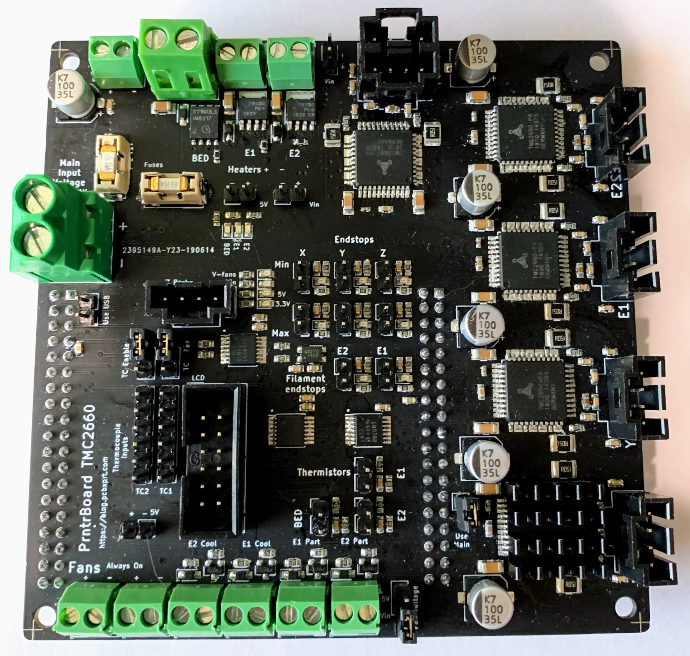

Prntr Board V1
======================
PrntrBoard is a 3D printer controller board designed to work with STM32 NUCLEO dev kits. The current version (V1) supports NUCLEO-64 series kits. The design is being developed on F446-RE kit, but other models could work as well. IMO the STM32F446 NUCLEO-64 kit offers very good performance (180MHz CPU) for the price ($15).

Some features of the board:
-----
  + 5x Trinamic super quiet drivers (TMC2130, TMC2660 or TMC2209)
  + Marlin 2.0 firmware
  + (2+2) controllable fans and 2x "always on" fan connectors
  + 3x min and max endstops for the x, y and z axis
  + 2x end stops for fillament end detection
  + SPI or I2C display connector for ST7735 or SSD1306 screen + one button and rotary encoder
  + Dual thermocouple connectors (for MAX31866, MAX31855 or MAX6675 boards)
  + Input voltage (Vin): 12-24V
  + selectable fan voltage (5V or Vin)

Because the NUCLEO-64 has limited number of IO pins, some compromises had to be made:
  + ~~No sd-card~~ (sd-card is added using new NUCLEO-64 compatible board)
  + The thermocouple connectors share pins with the E0 and E1 cool fan controls. You'll have to decide to use one or the other via jumpers on the board. Most printers I've seen come with "always on" extruder fans, the choice seemed like a worthy sacrifice.

Generic shortcuts I don't plan to improve:
------
  + ~~5V power supply is external. These are available from various resellers and fairly cheap - less than $1. No need to waste board layout space and component count.~~ (this has beed addresses with the new NUCLEO-64 compatible daugherboard)
  + Heated bed MOSFET - large heated beds consume a lot of power and it is challenging to provision the design for > 20A current (there is simply not enough copper space on the board to support this current). External heated bed MOSFETs are very affordable < $10 and support 20A-40A with no issues. If you have large heated bed - use external MOSFET or SSR.

Details
------
I use the daily build of KiCad (soon to be released V6) - let me know if you have trouble opening the files.

The current PCB desing is using 4 layer board, 6/6 mil track width/clearance, 12 mil min via hole size and 20 mil via diameter.

There are tree active branches:
  + tmc2130 - the board design for TMC2130 drivers
  + tmc2130-redesign - redesign of the TMC2130 branch with the nucleo board flipped
  + tmc2660 - the board design for TMC2660 drivers
  + tmc2209 - the board design for TMC2209 drivers

TMC2130 and TMC2660 PCB designs use the QFP version of the driver ICs, because they can handle a bit more power. The TMC2209 is available only in QFN package.

Status
------
TMC2130 version is table and been running for over a year. TMC2660 is being tested at the moment. Prototypes of the TMC2209 are being made.

old status:
I've been running a prototype of this board for a few months now and I'm very happy with the board stability. I'm trying to figure out how to make these at scale.

I have made prototypes of the TMC2130 board design (rev0) - the board has a few bugs, that are corrected in the rev1 version. Rev0 did not have LCD screen, it was added in Rev1. I'm trying to work-out the thermal design issues.
Rev1 board have been ordered and the dev branch is now switched to Rev2. The thermocouple connectors are added Rev2.
Rev2 borads have been ordered. The current working board is rev3. Added 2 more pins to the LCD connector
for the rotary encoder input. I also re-connected the E1 and E0 CS pins, so the LCD pins can be connected
to the hardware I2C pins. This way one can use SPI or I2C screens.

This branch is a redesign of the TMC2130 board. The main difference is that the NUCLEO board is flipped in a more natural position. In addition I'm now using a dedicated ground plane, larger heatsink areas for the mosfets. I'm much happier with the thermal layout of this branch.

The NUCLEO-64 board was limiting the design in many ways. I have a replacement board using STM32F407VE. This is 100 pin part. The new daughter board is the same form factor as the NUCLEO-64. It adds SPI EEPROM as well as native USB interface and micro SD-Card socket. The new board also has enough space for 24V to 5V buck converter, so power supply can beintegrated.

Tested circuits:
  + Heater control
  + Thermistor input
  + Fan control
  + Motor driver control
  + Z probe
  + End stops
  + Thermocuple interface (tested MAX31855 with Smoothieware)
  + LCD interface (tested REPRAP discount full graphics controller - the panel has issues
  sharing the SPI port with the TMC drivers. Could be solved with adapter board with extra AND gate)

Circuits that need verification:
  + Stall guard alert from the motor driver

Software
------

The software for the board is a clone of Marlin at [bugfix-2.0.x branch](https://github.com/ghent360/Marlin/tree/bugfix-2.0.x/ "Github.com") of my repository. It is quite usable. I keep it relatively in sync with the Marlin branch. *Note: there are other branches of Marlin, only the bugfix-2.0.x supports the STM32 microcontroller.*

Marlin is using Adruino IDE or Platform IO. I personally had issues with Platform IO not supporting the STM32F4 board, so I use Arduino version 1.8.5. To compile the firmware code you would need to install the [STM32 Arduino port](https://github.com/stm32duino/Arduino_Core_STM32 "www.stm32duino.com").

I'm also porting [Smoothieware](http://smoothieware.org) V1 to the board. So far I got the heater control and the stepper drivers working. My smoothie port is available [here](https://github.com/ghent360/Smoothieware-STM32F4 "Gitgub.com"). Please not the Smoothie port is not ready yet (there is an issue with the ADC). I have done only minimal tests so far.

Visit [my blog](https://blog.pcbxprt.com/) for status updates on the development of the board.

